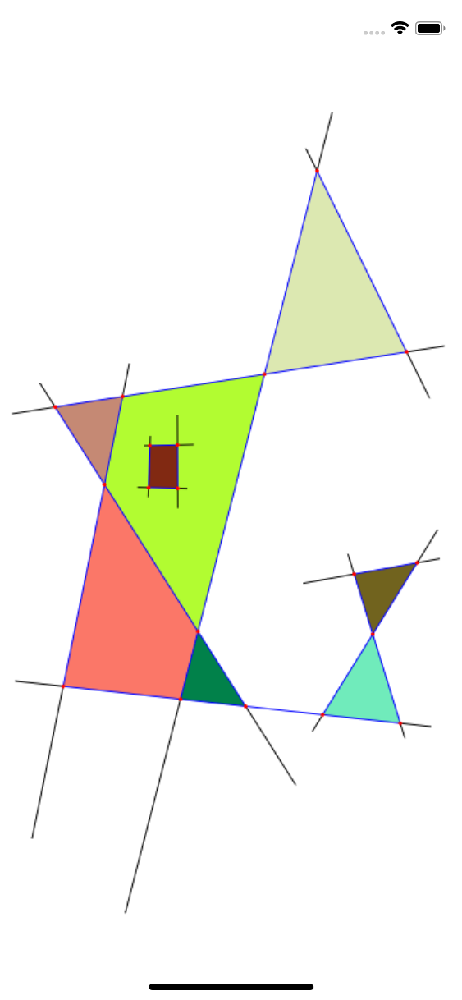

#  Graph Face Enumeration

## Excerise
Given is the following excercise:
1. Write an application which is able to draw straight lines. 
2. In case lines enclose an area, then this area has to be filled with a random colour.
3. Try to complete the described task within 24 hours, but do not use more than 48 hours. It is better to work slowly but make sure that everything is correct, rather than the other way around.
4. An algorithm for the mentioned task could be found [here](https://math.stackexchange.com/questions/1592799/algorithm-for-enumerating-all-the-faces-of-a-multigraph-with-given-planar-embedd).

The sample image below shows a graph with 8 enclosed areas. 

